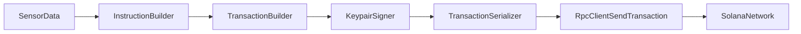

# SDK Architecture

Solduino SDK is organized as composable modules exposed through `solduino.h`.

## Layers

- **Network**: `RpcClient` for JSON-RPC calls over HTTPS.
- **Identity**: `Keypair` and crypto helpers for keys and signatures.
- **Transactions**: `Instruction`, `Message`, and `Transaction`.
- **Encoding**: `TransactionSerializer` and `Base64`.
- **Program helpers**: `SystemProgram`, `TokenProgram`, PDA utilities.

## Data Flow

## Source of Truth

Use these files when validating behavior:

- `sol/solduino.h`
- `sol/rpc_client.h`
- `sol/transaction.h`
- `sol/serializer.h`
- `sol/programs.h`
